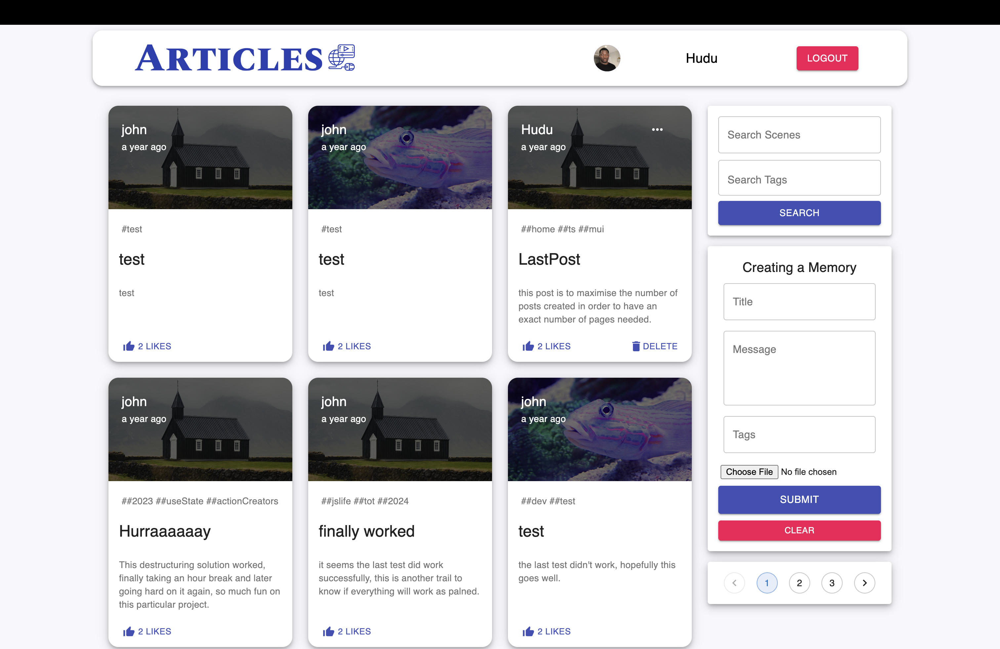

# Articles

This page was built with **React**, **React-Redux** for the frontend and **Express.js & Node.js** for backend with **Mongodb** as the database.

## Motive

The intention of building this project was part of a process to learn react-redux, that is to pass data and manage state accross different pages within an application. This enable users to interact with the page with all CRUD operations, that create posts, read, update, or delete posts they created.

## Tech Stack


## Features

- User authentication & authorization using JWT token
- Real-time state updates made possible using redux.
- MongoDB integration as database source
- React google login integration
- moment.js for posts dates and time formats
- Pagination support to improve performance

## Setup Steps

1. Clone repository
2. cd into either client or server directory first
3. `npm install` or `npm install --legacy-peer-deps` to ignore peer dependency flags
4. configure `.env or .env.local` locally
5. connect mongoose before running the server
6. voilà!

### Setup Environment Variables (.env.loca)

```
MONGODB_URL=
PORT=
```

## Status

All current features funtional, user can create, update, edit and delete post.

### Todo

- [ ] Implement comments UI under Posts
- [ ] Testing
- [ ] Restructure dashboard and postcard


